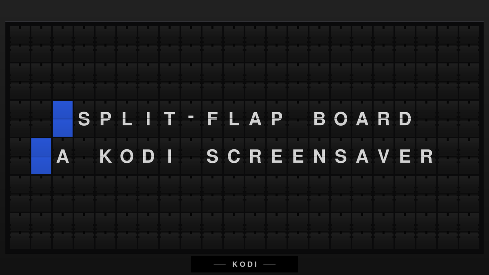

# Split-Flap Board for Kodi



A screensaver that renders a mechanical split-flap departure board — the kind
that used to clatter in railway stations and airports — showing motivational
phrases, the time, and the weather.

## Install

Install the repository once and everything else follows, including updates.

### 1. Download the repository add-on

**[⬇ repository.splitflap-1.0.0.zip](repo/repository.splitflap/repository.splitflap-1.0.0.zip)**

Download it on the Kodi box itself, or copy it over with a USB stick or a
network share.

### 2. Install it in Kodi

**Settings → Add-ons → Install from zip file →** pick the file you just
downloaded.

Kodi warns about installing from unknown sources the first time; that
warning is about zips in general, and you can enable it in **Settings →
System → Add-ons → Unknown sources**.

### 3. Install the screensaver

**Settings → Add-ons → Install from repository → Split-Flap Repository →
Look and feel → Screensaver → Split-Flap Board.**

Glyph packs and phrase sources live in the same repository, under
**Resource packages** and **Program add-ons**. Everything you install from
here updates itself from then on.

### Adding the source URL instead

If you would rather add the repository as a file source:

```
https://asm0dey.github.io/kodi-splitflap/repo
```

**Settings → File manager → Add source**, paste the URL, name it
`splitflap`. This is what the installed repository add-on already uses to
fetch updates, so step 1 above is the shorter path to the same place.

### Single add-on, no updates

If you only want the screensaver and do not care about updates, take the zip
directly — it will not update itself, and you will not get glyph packs:

- [screensaver.splitflap-0.1.14.zip](repo/screensaver.splitflap/screensaver.splitflap-0.1.14.zip)

## What's here

| Add-on | What it is |
|---|---|
| [`screensaver.splitflap`](repo/screensaver.splitflap/screensaver.splitflap-0.1.14.zip) | the screensaver |
| [`resource.images.splitflap.nimbus-ru`](repo/resource.images.splitflap.nimbus-ru/resource.images.splitflap.nimbus-ru-1.0.1.zip) | a glyph pack adding Cyrillic |
| [`script.splitflap.source.recentlyadded`](repo/script.splitflap.source.recentlyadded/script.splitflap.source.recentlyadded-0.1.1.zip) | a source add-on showing the latest library additions |
| [`repository.splitflap`](repo/repository.splitflap/repository.splitflap-1.0.0.zip) | this repository, so the others self-update |

The bundled glyphs cover capitals-only extended ASCII — Western European out of
the box. Anything else shows as tofu (□) until you install a pack, which
matters on a Fire TV or webOS device where there is no practical way to drop
files onto the box.

